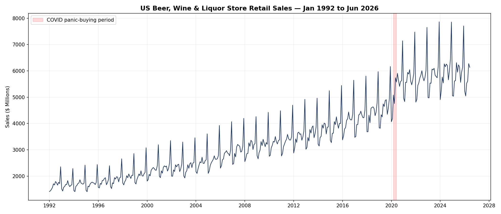
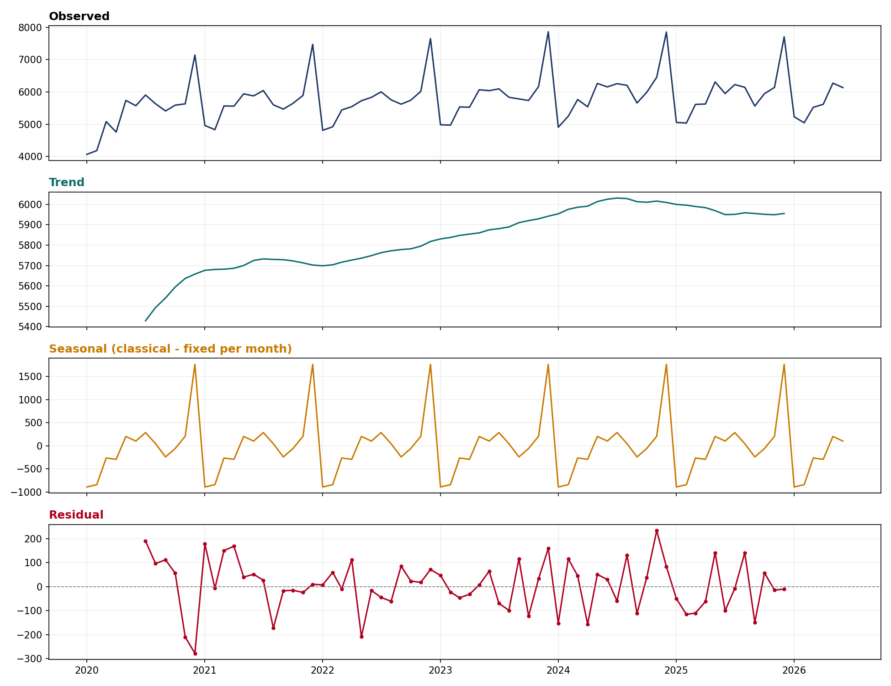
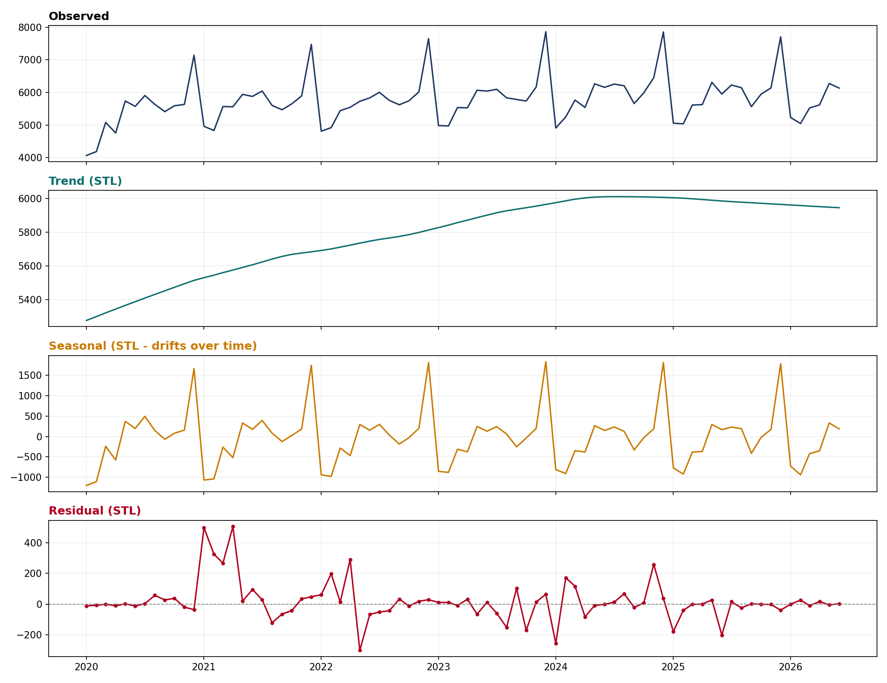
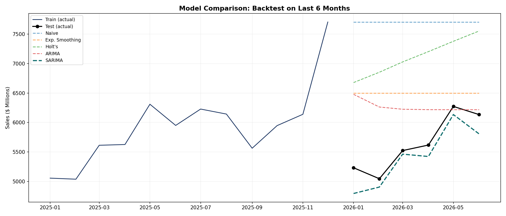
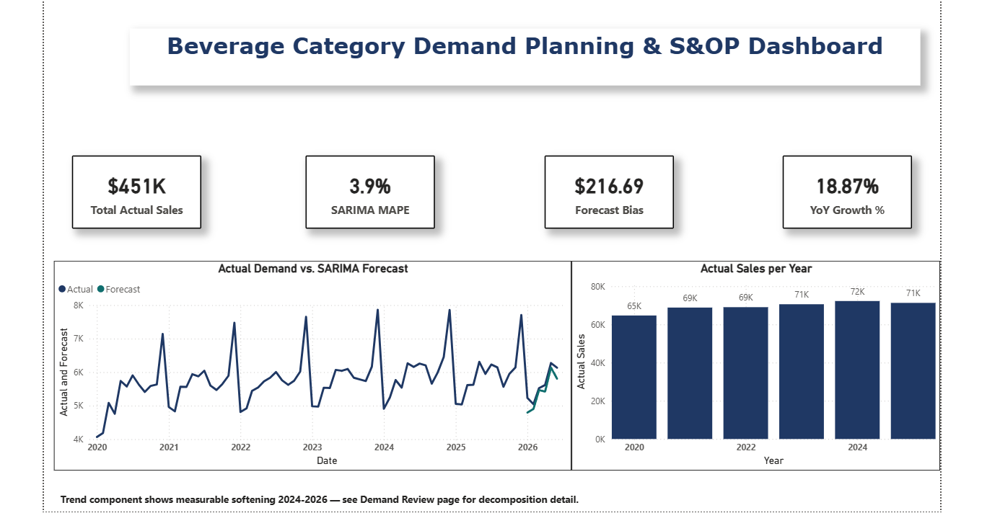
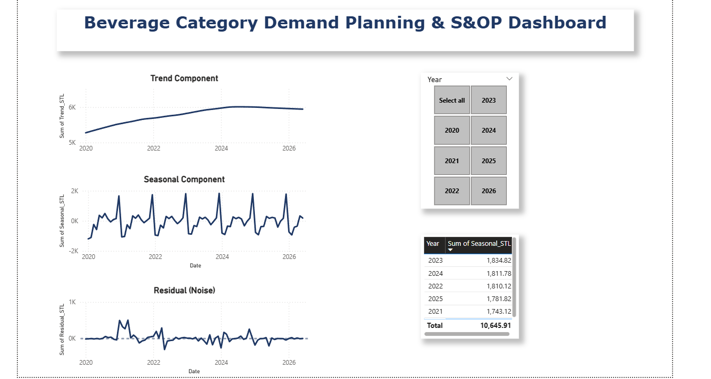
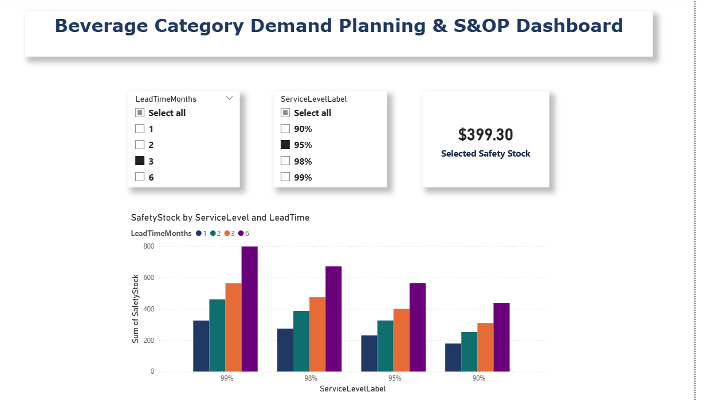
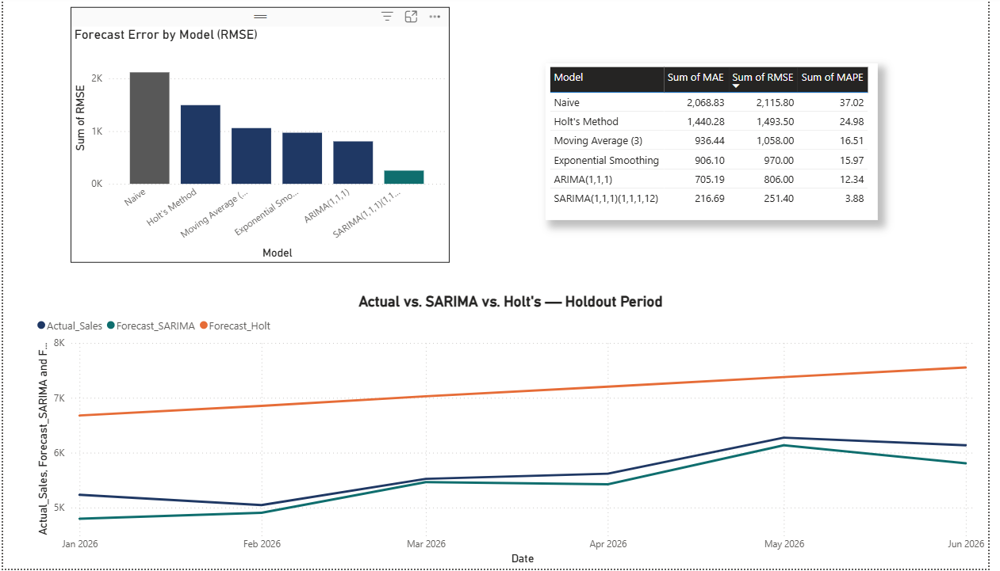
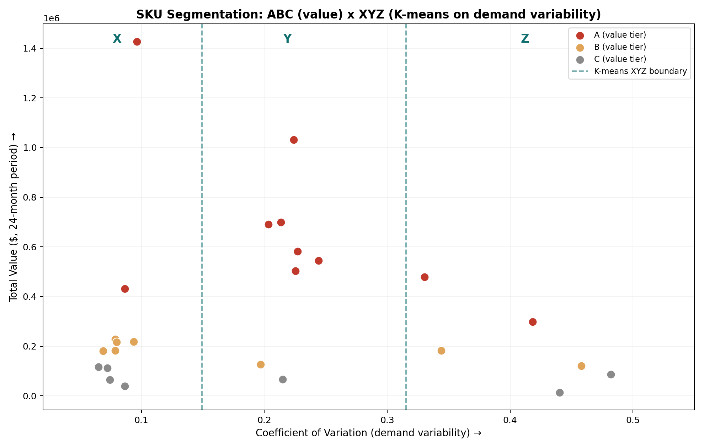

# US Beverage-Alcohol Category Demand Forecasting

A complete demand planning & forecasting workflow applied to real, publicly available U.S. retail sales data — built to demonstrate the reasoning and methodology used in FMCG/beverage demand planning roles.

## Business Context

Demand planners in the beverage-alcohol industry (e.g., at a company like Diageo) monitor category-level demand signals alongside brand-specific POS data to answer a recurring question: **based on this category's historical pattern, what should we expect next period, and how much safety stock buffer is defensible given our forecast's actual uncertainty?**

This project answers that question end-to-end using real data — not synthetic examples — and documents the *reasoning* behind each modeling decision, not just the code.



## Data

- **Source:** U.S. Census Bureau, Monthly Retail Trade Survey — Retail Sales: Beer, Wine, and Liquor Stores (NAICS 4453)
- **Access:** via FRED (Federal Reserve Economic Data), series `MRTSSM4453USN`
- **Coverage:** January 1992 – June 2026, monthly, not seasonally adjusted (deliberately — seasonality is something we detect and model ourselves, not something pre-removed)
- **Scope note:** this is a national, category-level aggregate (beer + wine + liquor combined), not a single brand or SKU. The same methodology applies directly at brand/SKU granularity; see *Limitations & Next Steps* below.

## Methodology

The notebook (`demand_forecasting_analysis.ipynb`) walks through:

1. **Exploratory Data Analysis** — visualizing the raw series, identifying a real anomaly period (COVID-era panic buying, March–June 2020) before any modeling
2. **Time Series Decomposition** — comparing **classical decomposition** (fixed seasonal averages, centered moving-average trend) against **STL** (Loess-based, allows seasonal amplitude to drift, covers full date range including series edges)
3. **Stationarity Testing** — formal Augmented Dickey-Fuller (ADF) tests confirming the raw series is non-stationary, and evaluating lag-1 (trend-removing) vs. seasonal lag-12 (seasonality-removing) differencing
4. **Baseline Forecasting Models** — Naive, 3-month Moving Average, Simple Exponential Smoothing, and Holt's Method, evaluated via honest backtesting (last 6 months held out)
5. **ARIMA & SARIMA** — comparing a non-seasonal ARIMA model against a SARIMA model with an explicit 12-month seasonal component
6. **Model Evaluation** — MAE, RMSE, and MAPE calculated on the same held-out backtest window for a fair, apples-to-apples comparison
7. **Safety Stock Calculation** — deriving a defensible inventory buffer directly from the selected model's own backtested forecast error (Z × σ × √Lead Time), rather than an arbitrary flat percentage

### Classical Decomposition vs. STL




## Key Findings

- **SARIMA substantially outperformed every other model on real, held-out data**: MAE of 216.69 vs. Naive's 2,068.83, RMSE of 251.44 vs. Holt's Method's 1,493.51, and MAPE under 4% vs. over 37% for Naive.
- **STL revealed the December seasonal effect is not fixed** — it grew from ~$1,660M (2020) to ~$1,835M (2023) before easing, a pattern classical decomposition's flat-averaging approach structurally cannot detect.
- **A real, current business signal surfaced directly from the data**: the trend component shows measurable softening in 2024–2026, consistent with recently reported industry-wide growth deceleration in the beverage-alcohol category.
- **An honest statistical nuance is documented, not hidden**: combining seasonal and lag-1 differencing together did not pass the ADF stationarity test (likely over-differencing), even though each differencing method individually did — a reminder that formal tests can behave counter-intuitively, and backtested model performance is ultimately the more reliable guide.



## Why This Matters for Demand Planning

Every seasonality-blind model tested (Moving Average, Exponential Smoothing, Holt's Method) systematically misforecasts around the December-to-January transition — because none of them have any mechanism to recognize "this calendar position behaves differently." SARIMA's explicit seasonal component corrects this. This isn't a marginal technical improvement — it's the difference between a safety stock plan built on a forecast that's off by single-digit percentages versus one that's off by 20-35%+, with direct, quantifiable cost implications for overstocking or stockouts.

---

## Companion Piece: Power BI S&OP Dashboard

A 4-page interactive Power BI dashboard translates this analysis into a business-facing S&OP planning tool, built on the same real dataset and the same model outputs from the notebook above. The `.pbix` file is included in this repo (`SOP_Demand_Dashboard.pbix`) — open it in Power BI Desktop to interact with it directly.

### Page 1 — Executive S&OP Summary
KPI cards for total sales, SARIMA forecast accuracy (MAPE), forecast bias, and year-over-year growth, alongside an actual-vs-forecast trend line and annual sales comparison.



### Page 2 — Demand Review
Interactive decomposition (trend, seasonal, residual) with a year slicer, plus a table proving the December seasonal effect is not fixed — it grew from 1,664 (2020) to a peak of 1,835 (2023) before easing, exactly matching the STL finding from the notebook.



### Page 3 — Supply & Safety Stock Planning
An interactive safety stock calculator — select a service level (90%-99%) and lead time (1-6 months) via slicers, and the buffer recalculates live using the real formula (Z × σ × √Lead Time), with σ derived from the SARIMA model's actual backtested forecast error.



### Page 4 — Forecast Model Comparison
The full 6-model comparison from the notebook, rendered interactively: SARIMA's RMSE of 251 against Holt's Method's 1,494, with a live line chart showing SARIMA tracking the actual holdout period closely while Holt's Method overshoots progressively due to mistaking the seasonal spike for ongoing trend.



---

## Limitations & Next Steps

- This is national, category-level data — not brand or SKU-level. The identical pipeline applies directly given brand-level data.
- A natural extension is **SKU/brand-tier segmentation** — using clustering methods (e.g., K-means on volume and volatility) to route different products to different forecasting methods and safety stock policies, matching model sophistication to each product's actual demand behavior rather than using one model for an entire portfolio.
- ARIMA/SARIMA orders were set using standard defaults for this demonstration; a production implementation would use formal grid search / AIC-based order selection.
- Companion piece: a Power BI S&OP dashboard (in progress) built on this same dataset, translating this analysis into a business-facing KPI view.

## Tools Used

Python, pandas, NumPy, statsmodels (seasonal_decompose, STL, ARIMA, SARIMAX, adfuller), Matplotlib

## Repository Structure

```
├── demand_forecasting_analysis.ipynb   # Full analysis notebook (executed, with outputs)
├── beer_wine_liquor_sales.csv          # Source data
├── outputs/                             # Saved chart images
└── README.md
```
## SQL Companion Analysis

The core Python/pandas analysis is recreated in SQL (`sql/sql_analysis.sql`) — demonstrating the same business logic using window functions, conditional logic, and joins directly against the dataset, verified to run cleanly end-to-end.

**Covers:**
- Aggregation and grouping (yearly totals, `WHERE` vs `HAVING`)
- Window functions: `RANK() OVER (PARTITION BY...)` to confirm December's seasonal dominance every year without collapsing any rows
- `LAG()` window functions recreating both lag-1 (trend-removing) and seasonal lag-12 (seasonality-removing) differencing directly in SQL — the same mechanics demonstrated by hand and in Python elsewhere in this project
- Rolling window moving averages (`ROWS BETWEEN ... PRECEDING AND CURRENT ROW`) recreating the MA(3) and MA(6) models
- `CASE WHEN` conditional categorization
- `LEFT JOIN` vs `INNER JOIN`, demonstrated against a supplementary events table, with the row-count difference (78 vs. 4) shown directly

Every query in this file has been tested and verified to execute without errors against the project dataset.

---

## ABC-XYZ SKU Segmentation (K-Means Clustering)

A companion analysis (`sku_segmentation/abc_xyz_kmeans_analysis.py`) demonstrating how a demand planner would decide which forecasting/inventory-control effort each product actually deserves, rather than applying the same method to every SKU.

**Methodology:**
- **ABC dimension** — classifies SKUs by total consumption value using the standard Pareto/cumulative-percentage method (A = top 80% of value, B = next 15%, C = remaining 5%)
- **XYZ dimension** — classifies SKUs by demand variability using **K-means clustering** (K=3) on each SKU's Coefficient of Variation, rather than picking arbitrary variability thresholds in advance. K-means finds the natural breaks in the data itself.

**Note on data:** SKU-level data is illustrative (built to reflect realistic stable/seasonal/erratic demand behavior across a mixed airline/retail-style product range), since real per-SKU sales data isn't publicly available. The methodology — including the K-means clustering approach — is identical to what would be applied against real SKU-level sales data.

**Key finding:** K-means correctly recovered the underlying demand-behavior groups without being told them in advance — cluster centers landed at CV ≈ 0.08 (X), 0.22 (Y), and 0.41 (Z), cleanly separating genuinely stable, seasonal, and erratic products.



**Why this matters:** the AZ quadrant (high value, erratic demand — e.g., a rare limited-edition product) is the hardest and highest-stakes group to plan for: too valuable to ignore, but too unpredictable for a sophisticated statistical model to reliably forecast. These products typically need a fundamentally different strategy (larger safety buffers, more frequent manual review) rather than more forecasting sophistication. Conversely, CX products (low value, stable demand) need minimal attention — just a standing reorder process.

- [Forecast Accuracy & Bias Analysis](./forecast_accuracy_bias/README_ForecastAccuracyBias_Addition.md) — why a good accuracy score doesn't mean an unbiased forecast, using real seasonal sales data
