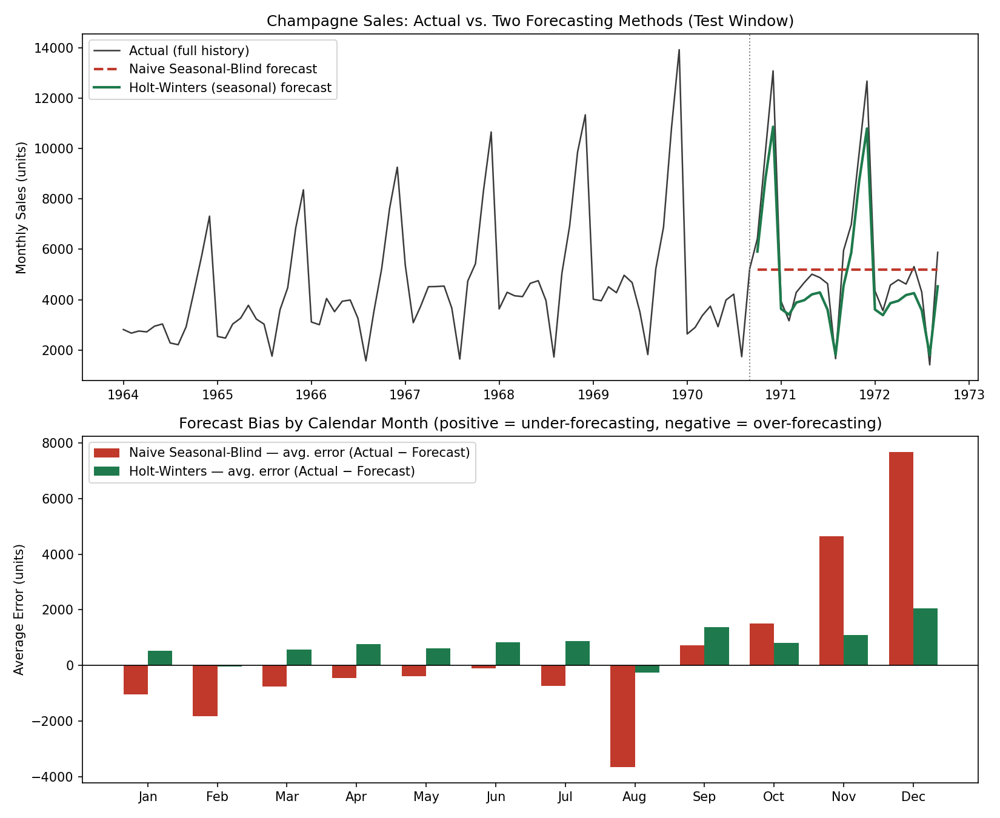

# Forecast Accuracy & Bias Analysis

**5th addition to the [Beverage-demand-forecasting](https://github.com/Naveen106-tr/Beverage-demand-forecasting) portfolio repo.**

## What this adds

Every forecasting metric I'd used before this — MAE, RMSE, MAPE — answers the
same underlying question: **how far off was the forecast?** All three use
*absolute* error, so a forecast that's too high by 500 units and one that's
too low by 500 units score identically.

This addition asks a different, arguably more actionable question:
**is the forecast wrong in a consistent direction?** A model can have a
perfectly respectable overall accuracy number while being structurally,
repeatedly wrong every single December — and accuracy metrics alone will
never surface that. That's what **Bias (Mean Error)** is for: it keeps the
sign of the error instead of taking the absolute value, so a consistent
pattern shows up instead of averaging itself out of view.

## Dataset

Real, publicly documented monthly champagne sales (Perrin Frères), Jan 1964
– Sep 1972 — a classic, widely-used open time-series dataset in forecasting
literature, chosen deliberately here because it has a large, genuine,
recurring December spike (New Year's Eve demand). That real seasonal pattern
is what makes the bias story real rather than manufactured for the sake of
the example.

## Method

- **Train/test split**: last 24 months held out as a test window.
- **Two forecasting methods, same train data:**
  1. **Naive Seasonal-Blind** — a 12-month trailing average held flat across
     the whole forecast window. This is a real, commonly-used shortcut when
     nobody has set up a proper seasonal model — and it completely ignores
     the seasonal pattern.
  2. **Holt-Winters (seasonal)** — triple exponential smoothing with
     multiplicative seasonality, which correctly models the recurring spike.
- **For both methods, computed on the test set:** MAE, RMSE, MAPE (accuracy)
  and Mean Error / Bias — both as a single overall number, and broken out
  **by calendar month**, since a blended annual bias figure hides exactly
  the pattern this analysis exists to find.

## Result

| Method | MAE | RMSE | MAPE | Bias (Mean Error) |
|---|---|---|---|---|
| Naive Seasonal-Blind (12mo avg) | 1,971 | 2,931 | **43.2%** | +465 |
| Holt-Winters (seasonal) | 830 | 973 | **14.7%** | +765 |

At the headline level, Holt-Winters is the clear winner on accuracy — less
than half the MAPE of the naive method. But the **bias-by-month** breakdown
is where the real finding is:

| Month | Naive avg. error | Holt-Winters avg. error |
|---|---|---|
| Aug | −3,658 (over-forecasting) | −268 |
| Nov | +4,652 (under-forecasting) | +1,084 |
| **Dec** | **+7,679 (under-forecasting)** | **+2,048 (under-forecasting)** |

The naive method doesn't just have a mediocre average error — it is
**catastrophically and consistently wrong every December**, under-forecasting
by nearly 8,000 units, every single year, in the same direction. A 43% MAPE
already looked bad; the bias breakdown explains *why* it's bad and *when* it
will hurt (right before your highest-demand month).

The more interesting, less obvious finding: **even the accurate model isn't
fully unbiased.** Holt-Winters posts a *positive* average error (i.e.
consistent under-forecasting) in 9 of 12 months — a smaller, quieter version
of the same pattern. Its much lower MAPE hides the fact that it's still
nudging low almost every month, just not by enough to blow up the headline
accuracy number. That's the core lesson of this whole exercise: **a good
accuracy score does not mean an unbiased forecast** — you have to check both.

## Files

- `forecast_accuracy_bias_analysis.py` — full script (data load → naive &
  Holt-Winters forecasts → accuracy metrics → bias by calendar month → chart)
- `champagne_sales_raw.csv` — source data
- `forecast_accuracy_summary.csv` — overall MAE/RMSE/MAPE/Bias per method
- `forecast_bias_by_month.csv` — full monthly error breakdown
- `forecast_bias_chart.png` — actual vs. both forecasts, plus bias-by-month
  bar chart

